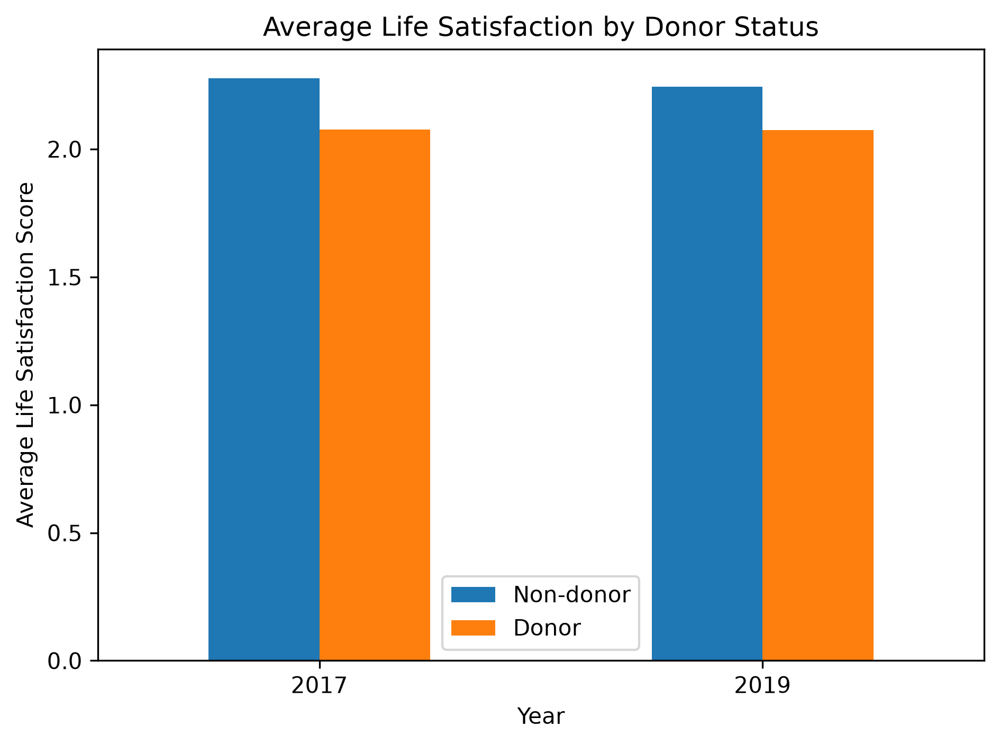
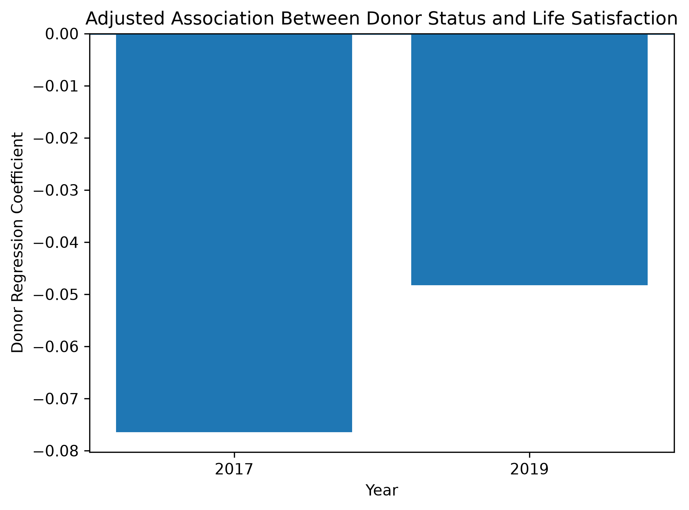

# Giving and Happiness Analysis

## Project Overview

This project explores the relationship between charitable giving, life satisfaction, income and wealth using data from the Panel Study of Income Dynamics (PSID).

The analysis uses household-level data from 2017 and 2019 to investigate whether people who donate to charity report greater life satisfaction, and whether changes in giving are associated with changes in life satisfaction over time.

## Skills Demonstrated

- Python
- pandas and NumPy
- Data cleaning and transformation
- Exploratory data analysis
- Statistical testing
- Correlation analysis
- OLS regression
- Data visualisation with Matplotlib
- Git and GitHub

## Research Questions

- Do donors report higher life satisfaction than non-donors?
- Is the amount donated associated with life satisfaction?
- Is giving as a percentage of income associated with life satisfaction?
- Do changes in donations between 2017 and 2019 relate to changes in life satisfaction?
- Does the relationship between donor status and life satisfaction remain after accounting for income, wealth, age, education and health?

## Dataset

Data was sourced from the Panel Study of Income Dynamics (PSID).

The project uses family-level variables from 2017 and 2019, including:

- Life satisfaction
- Charitable donation status
- Donation amounts across multiple categories
- Family income
- Household wealth
- Age
- Sex
- Education
- Employment status
- Marital status
- Health status

The cleaned dataset contained 10,822 rows.

PSID data are not included in this public repository.

## Tools Used

- Python
- pandas
- NumPy
- Matplotlib
- SciPy
- statsmodels
- Jupyter Notebook
- Git
- GitHub

## Data Preparation

The raw PSID data required several preparation steps before analysis.

These included:

- Renaming coded PSID variables into readable column names
- Handling missing and special response values
- Combining donation categories into total annual donations
- Creating donor/non-donor indicators
- Calculating giving as a percentage of household income
- Checking contradictory donation records
- Exporting a cleaned dataset for analysis

## Exploratory Analysis

The analysis compared donors and non-donors and examined the relationships between charitable giving, financial circumstances and life satisfaction.

Independent-samples t-tests showed statistically significant differences in average life satisfaction between donors and non-donors in both 2017 and 2019.

Donors reported slightly better life satisfaction on average.

However, correlations between the amount donated and life satisfaction were weak, while giving as a percentage of income showed almost no linear relationship with life satisfaction.

Changes in donations between 2017 and 2019 were also not meaningfully associated with changes in life satisfaction.

## Regression Analysis

OLS regression models were used to examine whether donor status remained associated with life satisfaction after accounting for:

- Household income
- Household wealth
- Age
- Education
- Health status

Donor status remained statistically significant in both years.

| Year | Donor coefficient | p-value | R² |
|---|---:|---:|---:|
| 2017 | -0.0765 | 0.00006 | 0.110 |
| 2019 | -0.0483 | 0.01089 | 0.110 |

Lower life-satisfaction scores indicate greater satisfaction, so the negative coefficients indicate that donors were associated with slightly greater life satisfaction.

The effect was small.

## Key Findings

- Donors reported slightly greater life satisfaction than non-donors in both 2017 and 2019.
- The difference remained statistically significant after controlling for several demographic and financial variables.
- Donation amount itself had only a weak relationship with life satisfaction.
- Giving as a percentage of income showed almost no relationship with life satisfaction.
- Increases in donations between 2017 and 2019 were not meaningfully associated with improvements in life satisfaction.
- Household income showed a stronger relationship with life satisfaction than donation amount.
- Household wealth was not statistically significant in the final regression models once the other variables were included.

## Interpretation

The results suggest that being a donor is associated with slightly greater reported life satisfaction.

However, the analysis does not show that donating causes greater happiness.

The weak relationships between donation amount, giving rate and changes in life satisfaction suggest that the relationship is more complex than simply "giving more makes people happier."

## Visualisations

### Average Life Satisfaction by Donor Status



Donors reported slightly lower life-satisfaction scores than non-donors in both 2017 and 2019. Because lower scores indicate greater life satisfaction in this measure, donors reported slightly greater satisfaction on average.

### Adjusted Association Between Donor Status and Life Satisfaction



The donor coefficient was negative in both years. Because lower life-satisfaction scores indicate greater satisfaction, this means donor status remained associated with slightly better life satisfaction after accounting for income, wealth, age, education and health.

## Limitations

- The study uses observational survey data, so causal conclusions cannot be made.
- Life satisfaction is self-reported.
- Some variables contain missing responses.
- Charitable giving may be influenced by factors not included in the models.
- The regression models explain only part of the variation in life satisfaction.
- Donation values are highly skewed because a small number of households make very large donations.

## Project Structure

```text
giving-happiness-analysis/
│
├── notebooks/
│   ├── 01_data_cleaning.ipynb
│   ├── 02_exploratory_analysis.ipynb
│   └── 03_final_analysis.ipynb
│
├── outputs/
│   ├── exploratory_summary.csv
│   ├── final_model_results.csv
│   ├── life_satisfaction_by_donor.png
│   └── donor_regression_effect.png
│
├── .gitignore
└── README.md